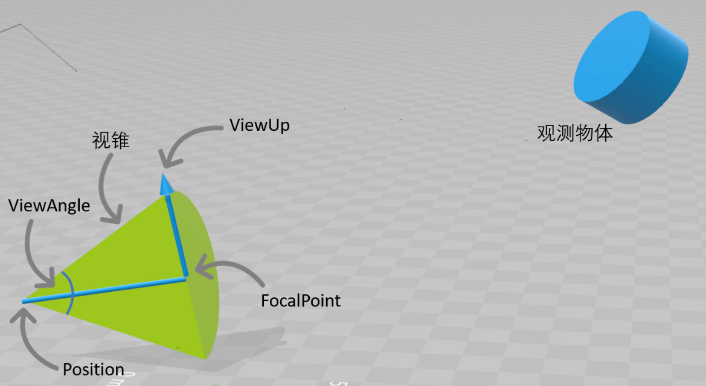
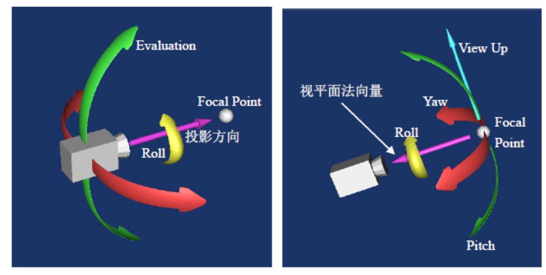
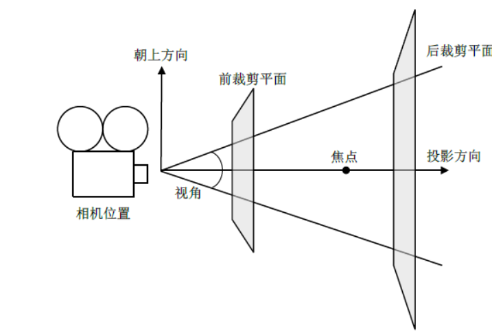
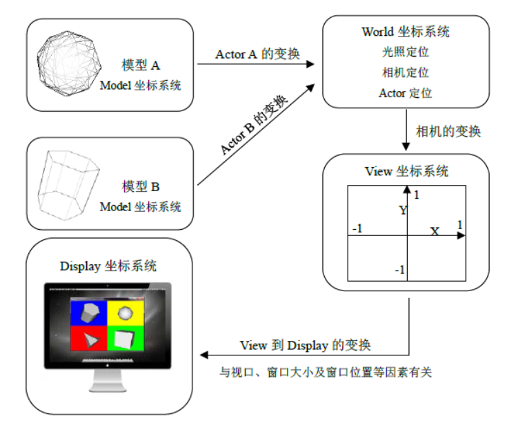

# Matrix

## 4x4 matrix guide
```C
// NDI 的模型坐标信息包括tx,ty,tz,q0,qx,qy,qz,然后进行坐标信息的转换
#include <vtkMatrix4x4.h>
#include <vtkSmartPointer.h>
#include <vtkTransform.h>

vtkMatrix4x4* GetTransformationMatrixFromNDI(float tx, float ty, float tz, float q0, float qx, float qy, float qz) {
    vtkSmartPointer<vtkMatrix4x4> transformMatrix = vtkSmartPointer<vtkMatrix4x4>::New();
    transformMatrix->Identity();

    // 计算旋转矩阵
    transformMatrix->SetElement(0, 0, 1 - 2*qy*qy - 2*qz*qz);
    transformMatrix->SetElement(0, 1, 2*qx*qy - 2*qz*q0);
    transformMatrix->SetElement(0, 2, 2*qx*qz + 2*qy*q0);
    
    transformMatrix->SetElement(1, 0, 2*qx*qy + 2*qz*q0);
    transformMatrix->SetElement(1, 1, 1 - 2*qx*qx - 2*qz*qz);
    transformMatrix->SetElement(1, 2, 2*qy*qz - 2*qx*q0);
    
    transformMatrix->SetElement(2, 0, 2*qx*qz - 2*qy*q0);
    transformMatrix->SetElement(2, 1, 2*qy*qz + 2*qx*q0);
    transformMatrix->SetElement(2, 2, 1 - 2*qx*qx - 2*qy*qy);

    // 平移部分
    transformMatrix->SetElement(0, 3, tx);
    transformMatrix->SetElement(1, 3, ty);
    transformMatrix->SetElement(2, 3, tz);

    return transformMatrix;
}

// 从NDI获取到的数据
float tx = 10.0, ty = 5.0, tz = 15.0;
float q0 = 1.0, qx = 0.0, qy = 0.0, qz = 0.0;

// 生成变换矩阵
vtkMatrix4x4* transformMatrix = GetTransformationMatrixFromNDI(tx, ty, tz, q0, qx, qy, qz);

// 应用到vtk模型
vtkSmartPointer<vtkActor> actor = vtkSmartPointer<vtkActor>::New();
actor->SetUserTransform(vtkSmartPointer<vtkTransform>::New());
actor->GetUserTransform()->SetMatrix(transformMatrix);


```

## Camera
> https://www.cnblogs.com/ybqjymy/p/13925462.html



> 示意图



## 坐标转换
```shell
计算机图形学里常用的坐标系统主要有四种，分别是：Model坐标系统、World坐标系统、View坐标系统和Display坐标系统，以及两种表示坐标点的方式：以屏幕像素值为单位和归一化坐标值(各坐标轴取值都为[-1, 1])。它们之间的关系如图所示。

Model坐标系统是定义模型时所采用的坐标系统，通常是局部的笛卡尔坐标系。例如，我们要定义一个表示球体的Actor，一般的做法是将该球体定义在一个柱坐标系统里。

World坐标系统是放置Actor的三维空间坐标系，Actor其中的一个功能就是负责将模型从Model坐标系统变换到World坐标系统。每一个模型可以定义有自己的Model坐标系统，但World坐标系只有一个，每一个Actor必须通过放缩、旋转、平移等操作将Model坐标系变换到World坐标系。World坐标系同时也是相机和光照所在的坐标系统。

View坐标系统表示的是相机所看见的坐标系统。X、Y、Z轴取值为[-1, 1]，X、Y值表示像平面上的位置，Z值表示到相机的距离。相机负责将World坐标系变换到View坐标系。

Display坐标系统跟View坐标系统类似，但是各坐标轴的取值不是[-1, 1]，而是使用屏幕像素值。屏幕上显示的不同窗口的大小会影响View坐标系的坐标值[-1, 1]到Display坐标系的映射。可以把不同的渲染场景放在同一个窗口进行显示，例如，在一个窗口里，分为左右两个渲染场景，这左右的渲染场景(vtkRenderer)就是不同的视口(Viewport)。例子Viewport演示了把一个窗口分为四个视口，用vtkRenderer::SetViewport()来设置视口的范围(取值为[0, 1])：

1 renderer1->SetViewport(0.0, 0.0, 0.5, 0.5);2 renderer2->SetViewport(0.5, 0.0, 1.0, 0.5);3 renderer3->SetViewport(0.0, 0.5, 0.5, 1.0);4 renderer4->SetViewport(0.5, 0.5, 1.0, 1.0);

```





